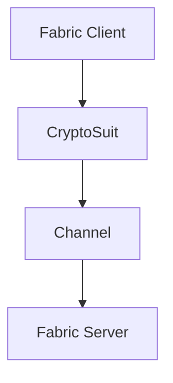

### Fabric client & Server
#### 1 Fabric SDK Client
Fabirc是现在比较成熟的联盟链的产品。但是在使用它或者认识它的过程中，发现理解它还是有一定的难度的。针对使用过程中的一些心得，做一些总结。

##### 1.1 Fabric Client SDK
Fabirc Client SDK经过了几次的迭代，从早期的1.x版本到现在的2.x版本，整体来说是代码做了一些重构。但是从代码设计的角度来讲，那就不是简单的代码重构了，
而是代码职责的厘清和设计模式的应用，让代码更可读，也更易扩展。

###### 1.1.1 Fabric 1.x
Fabric 1.x 版本，具体说来要分成两个阶段。一个是1.4之前的，一个是1.4 版本。这两个版本在代码方面做了很大的重构，减少了一些代码的冗余。 首先看1.4之前的版本。
这个版本的SDK是按照功能来组织代码的。核心的类如Client， CryptoSuit，Channel， Peer， Orderer 等。代码职能清晰，但是不易扩展。比如，如果想要自定义签名，处理proposal等
都不是那么容易的事情。而且在Fabric Client和Fabric CA Client中对CryptoSuit的代码是重复的。

1.4版本是一个比较大的改动。首先是将代码进行了重构，和fabirc交互的方式由之前的面向Client转向了面向Gateway的方式。这个变化极大的简化了Client application的开发，应用不再
过多的关注一些底层的东西。比如怎样去组织Channel，什么时候需要SendProposal，什么时候又要Broadcast Proposal Response到Orderer等。面向Gateway的方式使得客户端的编程更多的是关注
业务逻辑。当然，过多的抽象包装在一定程度上也限制了扩展的自由。特别是在Typescript下，很多类的方法你根本就用不上，尽管他们就在那里。所以，要定制化，就必须对Fabric client SDK
有深入的了解，不然一步一坑。

