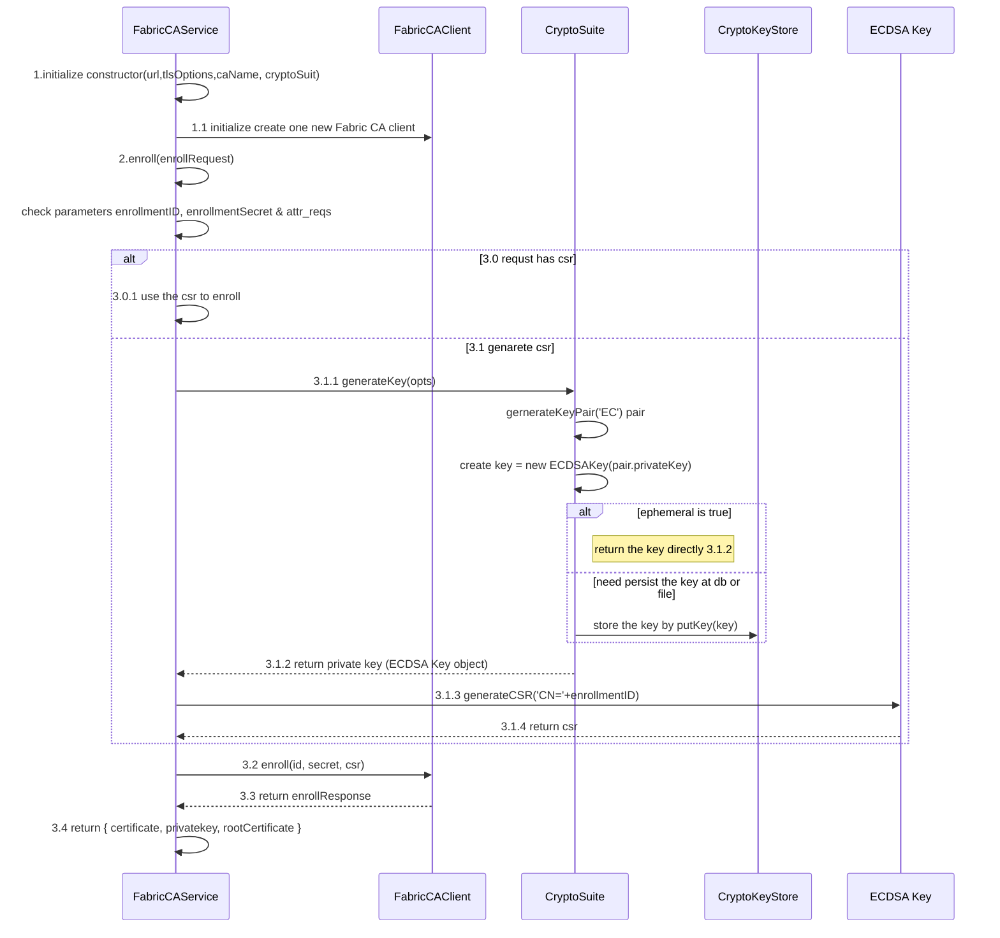
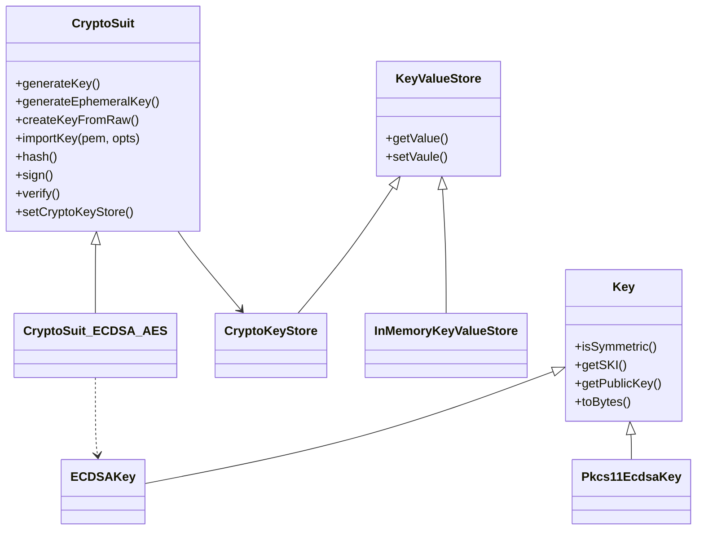

### Fabric client & Server
#### 1 Fabric SDK Client
Fabirc是现在比较成熟的联盟链的产品。但是在使用它或者认识它的过程中，发现理解它还是有一定的难度的。针对使用过程中的一些心得，做一些总结。

##### 1.1 Fabric Client SDK
Fabirc Client SDK经过了几次的迭代，从早期的1.x版本到现在的2.x版本，整体来说是代码做了一些重构。但是从代码设计的角度来讲，那就不是简单的代码重构了，
而是代码职责的厘清和设计模式的应用，让代码更可读，也更易扩展。

###### 1.1.1 Fabric 1.x
Fabric 1.x 版本，具体说来要分成两个阶段。一个是1.4之前的，一个是1.4 版本。这两个版本在代码方面做了很大的重构，减少了一些代码的冗余。 首先看1.4之前的版本。
这个版本的SDK是按照功能来组织代码的。核心的类如Client， CryptoSuit，Channel， Peer， Orderer 等。代码职能清晰，但是不易扩展。比如，如果想要自定义签名，处理proposal等
都不是那么容易的事情。而且在Fabric Client和Fabric CA Client中对CryptoSuit的代码是重复的。

1.4版本是一个比较大的改动。首先是将代码进行了重构，和fabirc交互的方式由之前的面向Client转向了面向Gateway的方式。这个变化极大的简化了Client application的开发，应用不再
过多的关注一些底层的东西。比如怎样去组织Channel，什么时候需要SendProposal，什么时候又要Broadcast Proposal Response到Orderer等。面向Gateway的方式使得客户端的编程更多的是关注
业务逻辑。当然，过多的抽象包装在一定程度上也限制了扩展的自由。特别是在Typescript下，很多类的方法你根本就用不上，尽管他们就在那里。所以，要定制化，就必须对Fabric client SDK
有深入的了解，不然一步一坑。

首先,先来看一下Fabric Client SDK中比较重要的一个组件 - Fabric CA Client.为什么重要?因为所有的其它组件的如peer, orderer等的msp都依靠它而产生.Client Application要和整个Fabric network交互,也要由它先产生一个合法的身份. 那么怎样来友Fabric CA产生一个身份.这里有两个操作,一个是Register,另外一个是Enroll.对于Register来说,它只是一个client调用Server API的过程.
```
async register(enrollmentID, enrollmentSecret, role, affiliation, maxEnrollments, attrs, signingIdentity) {
	// all arguments are required, validate if missing any required parameters
	if (arguments.length < 7) {
		throw new Error('Missing required parameters. \'enrollmentID\', \'enrollmentSecret\', \'role\', \'affiliation\', ' +
			'\'maxEnrollments\', \'attrs\' and \'signingIdentity\' are all required.');
	}
	if (typeof maxEnrollments !== 'number') {
		throw new Error('Parameter \'maxEnrollments\' must be a number');
	}
	// 自定义密码或者由CA Server给你生成一个。这个密码将是你enroll时的凭证,使用Basic Authorazation
	if (typeof enrollmentSecret === 'string' && enrollmentSecret !== '') {
		regRequest.secret = enrollmentSecret;
	}

	const response = await this.post('register', regRequest, signingIdentity);
	return response.result.secret;
}
```

而Enroll的过程,我们可以看一下如下的时序图,可以了解Enroll的过程是怎么实现的.


再来看一看重构后的Fabric 1.4对CryptoSuit的整体类图

